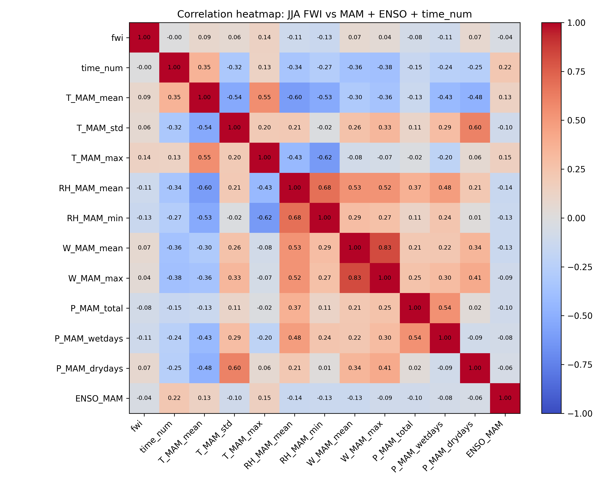
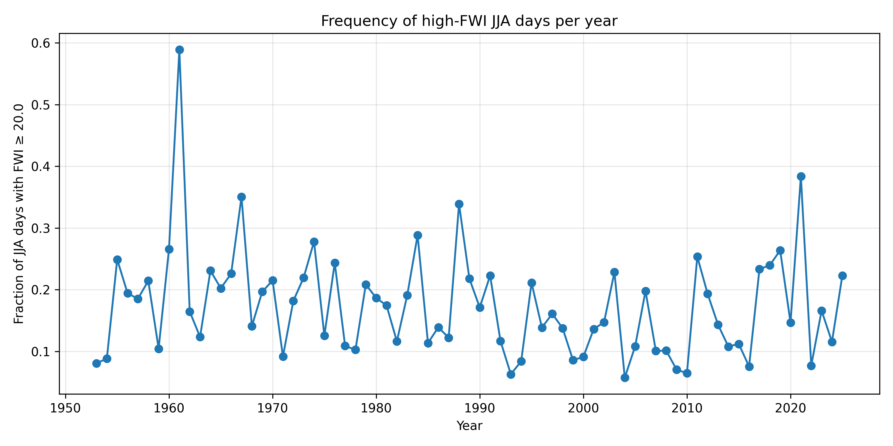
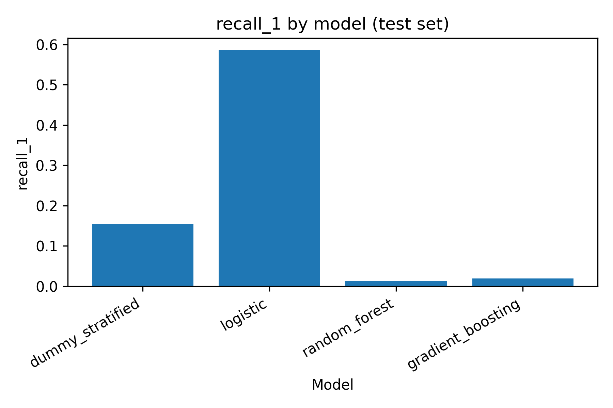

# Preseason Climate Controls on Summer Fire Weather in Manitoba

## Introduction
Wildfires are a recurring natural hazard in Canada and an increasing concern
under a warming climate. While the Canadian Fire Weather Index (FWI) is widely
used for short-term fire danger assessment, it typically provides only a few
days of lead time. For fire management and preparedness, it is important to
understand whether **preseason climate conditions** can provide earlier
guidance on summer fire danger.

This project investigates whether daily summer fire danger in Manitoba,
expressed using the Canadian Fire Weather Index (FWI), can be predicted from
spring (March-April-May, MAM) climate summaries and large-scale climate
variability represented by ENSO (Niño 3.4).

---

## Methodology
The prediction problem is formulated as a **binary classification task**, where
a high fire danger day is defined as **FWI ≥ 20** during the summer season
(June-July-August, JJA).

Two modeling phases are evaluated:
- **Phase 1:** Models using only local preseason (MAM) climate features.
- **Phase 2:** The same models augmented with a spring ENSO index
  (Niño 3.4 MAM mean).

Four classifiers are compared:
- Stratified Dummy Classifier 
- Logistic Regression 
- Random Forest
- Gradient Boosting

A temporal split is applied, training on years **before 2010** and testing on
**2010-2025**, to mimic a forecasting setting.

---

## Data
Daily fire weather and FWI records from the Canadian Wildland Fire Information
System (CWFIS) were used for the period **1953-2025**, filtered to Manitoba.
Preseason MAM features were constructed at the station-year level using summary
statistics of temperature, relative humidity, wind speed, and precipitation.

Large-scale climate forcing was represented by the **Niño 3.4 ENSO index**
(ERSSTv5), averaged over MAM. Data limitations include class imbalance, uneven
station coverage in early decades, and the use of FWI as a proxy for fire
activity rather than observed fire occurrence.

---

## Results

### Correlation structure of climate variables

### Frequency of high-FWI events

### Recall comparison across models

### Summary of model performance (test period)
Table below summarizes test-period performance for both modeling phases.

| Model | Acc (P1) | Rec (P1) | F1 (P1) | Brier (P1) | Acc (P2) | Rec (P2) | F1 (P2) | Brier (P2) |
|------|----------|----------|---------|------------|----------|----------|---------|------------|
| Dummy | 0.72 | 0.15 | 0.17 | 0.28 | 0.72 | 0.15 | 0.17 | 0.28 |
| Logistic Regression | 0.56 | 0.60 | 0.33 | 0.25 | 0.57 | 0.59 | 0.33 | 0.24 |
| Random Forest | 0.82 | 0.01 | 0.02 | 0.15 | 0.82 | 0.01 | 0.02 | 0.15 |
| Gradient Boosting | 0.81 | 0.02 | 0.04 | 0.15 | 0.82 | 0.01 | 0.02 | 0.14 |

Logistic regression results show only minor changes after adding ENSO.

---

## Discussion
Preseason local climate conditions in Manitoba contain useful information about
summer fire danger, but predictive skill at the daily scale is limited.
Logistic regression consistently sacrifices overall accuracy in exchange for
substantially improved recall of high-FWI days, making it more suitable for
risk-oriented early warning.

Tree-based models achieve high accuracy and low Brier scores but almost never
detect high-risk days due to strong class imbalance. Adding a spring ENSO index
provides, at most, modest additional information and does not fundamentally
change model behavior. These results suggest that ENSO may be more useful for
coarser seasonal assessments rather than daily station-level prediction.

---

## References
- Canadian Wildland Fire Information System (CWFIS)
- NOAA Climate Prediction Center – Niño 3.4 Index
- Bedia et al. (2018); Di Giuseppe et al. (2024); Van Wagner (1987)
